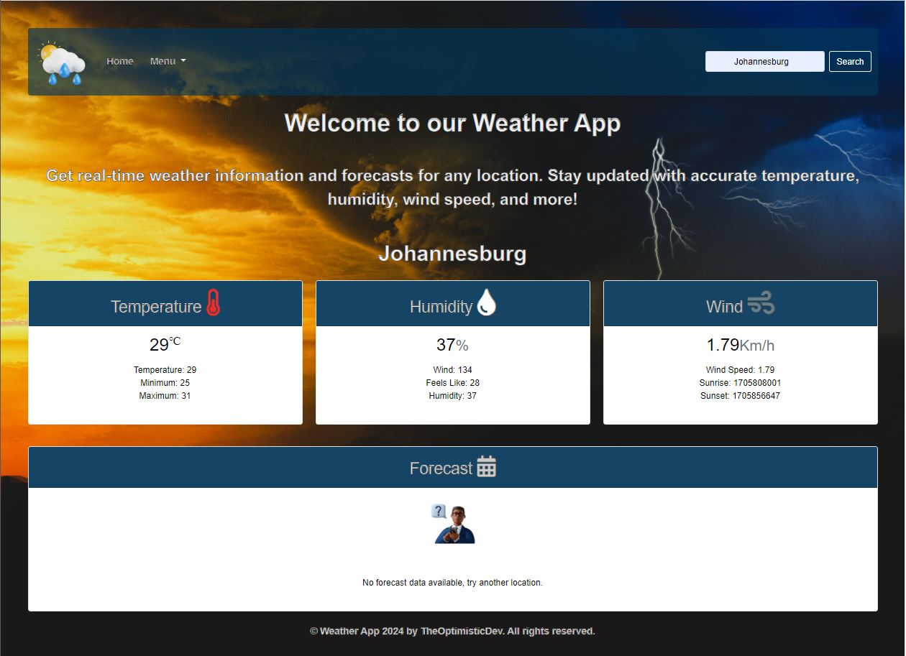
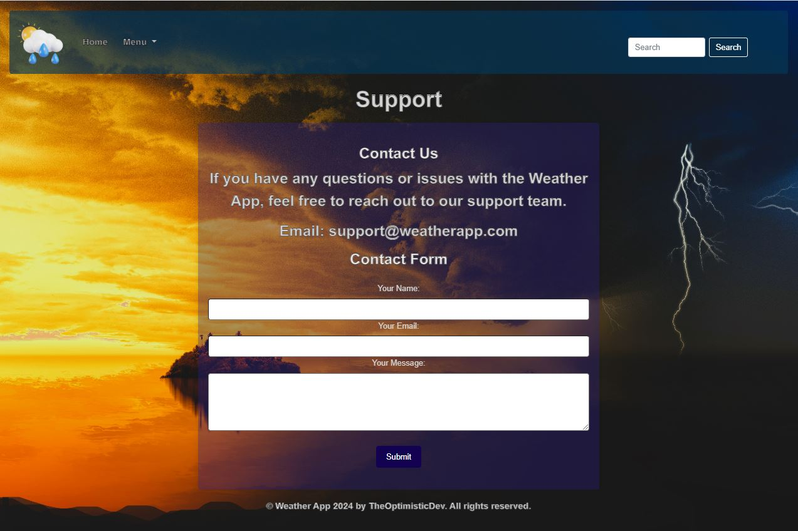
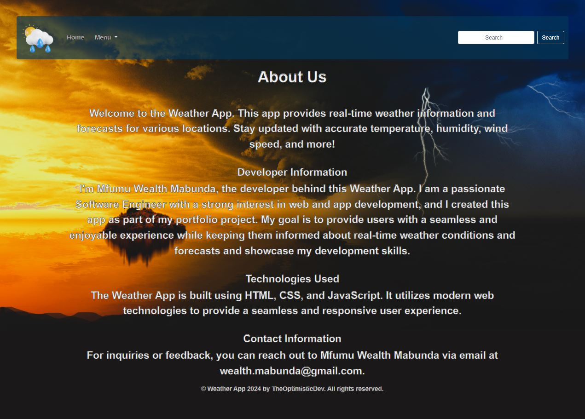

# Weather App

## Overview

This is a straightforward weather app that provides users with basic current weather information for a given city. It allows users to check the temperature and a brief description of the weather conditions.

## Table of Contents

- [Features](#features)
- [Demo](#demo)
- [Getting Started](#getting-started)
- [Prerequisites](#prerequisites)
- [Installation](#installation)
- [Technologies Used](#technologies-used)
- [Acknowledgements](#acknowledgements)
- [License](#license)

## Features

- **Current Weather:**
  - Display the current temperature in Celsius.
  - Show a brief description of the weather conditions.

- **Location Input:**
  - Users can enter the name of the city to get weather information.

## Demo

### Screenshots


*Home Page*


*Support Page*


*About Page*

## Getting Started

### Prerequisites

- Node.js and npm installed on your machine.

### Installation

1. Clone the repository:

   ```bash
    git clone https://github.com/your-username/weather-app.git

2. Navigate to the project directory:
    cd weather-app

3. Go live:
    port:5500

## Technologies Used

- HTML/CSS
- JavaScript
- Bootstrap

## Acknowledgements

- Weather data sourced from API Ninjas [API Ninjas](https://api-ninjas.com/).
- Logo obtained from Vectors [Vectors](https://www.vecteezy.com/png/27079477-sun-with-rain-light-weather-3d-illustration).
- Gif's and background image obtained from Gifer [Gifer](https://gifer.com/en/).
- Illustrations obtained from Icons8 [icons8](https://icons8.com/illustrations).
- Icons obtained from Google fontawesome icons [google](https://fontawesome.com/).
- Favicon created from Favicon.io [Favicon](favicon.io).

## License

* This project is licensed under MIT License, see the LICENSE file for details.